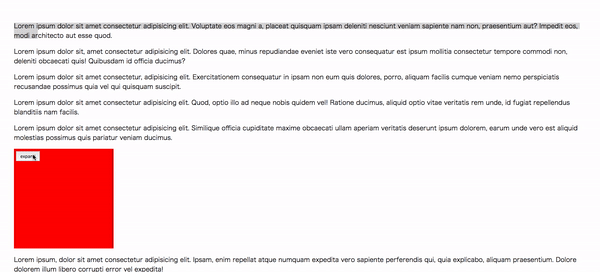

# react-ui-expand



## Install

```
$ npm install react-ui-expand --save
```

## Usage

```js
import * as React from 'react';
import { render } from 'react-dom';

import Expand from 'react-ui-expand';

const Demo = () => {
  return (<Expand 
    className="hoge" 
    button={<button>Open!!</button>}
    >
    {(button) => {
      return(<div>{button}
        This Element will expand to fullscreen!!
      </div>);
    }}
  </Expand>)
};

render(<Demo/>, document.getElementById('demo'));
```

## Props

